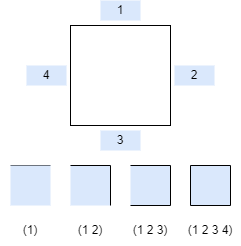
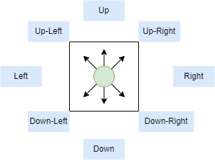

# Find the solution for a Maze using artificial intelligence
This project aims to find the solution for a Maze. It is implented in Lisp and the available algorithms to find the solution are:

* Star algorithm
* Depth First Search
* Breadth First Search
* Best First Search

## Maze table
To design the maze table, it is required to specify the number of rows, columns, initial state, final state, and the set of squares to fill the maze. 

Each square has an id as is shown in Figure 1. The format is `(1 UP)`, `(2 RIGHT)`, `(3 DOWN)`, and `(4 LEFT)`. Where each number represents a border.



Figure 1. Design of each square of a maze table

To design the full maze table, each square should be specified in the following format.
``` 
; NUMBER OF ROWS AND COLUMNS
3 3
; INITIAL AND FINAL STATES
0 0
2 2
; MAZE 
; (1 UP) (2 RIGHT) (3 DOWN) (4 LEFT)
(2 4) (2 3 4) (1 2 4)
(3 4) (1) (2)
(1 2) (2 3 4) (2 4)
```


## Movements

The output is the set of movements to follow to solve the maze.




# Execution
To run the code follow these steps
* Clone the repository. `git clone https://github.com/gnzdotmx/mazesolver.git`
* Specify the maze table to solve. (maze.cl:Line 378)
* Specify the algorithm to use. (maze.cl:Line 380)
* Build the docker container. `docker compose build`
* Run the docker container. `docker compose up`